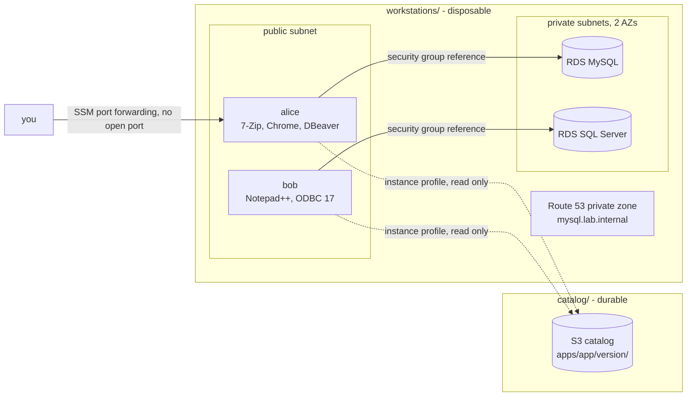

# aws-windows-workstations

[](https://github.com/renan-amorim-costa/aws-windows-workstations/actions/workflows/ci.yml)

On-demand Windows workstations on AWS, built with Terraform. Each person gets
an isolated machine that installs its own apps on first boot - pinned versions
from a private catalog - and, if it needs databases, gets them created, named
and pre-loaded in DBeaver. Tear it all down when you are done.

Adding a person is one entry in `terraform.tfvars`.

```hcl
workstations = {
  alice = {
    apps      = { "7zip" = "24.08", chrome = "latest", webview2 = "latest", dbeaver = "26.2.0" }
    databases = ["mysql"]
  }
}
```

## What you get

- **A Windows Server 2022 workstation per person**, with the apps they asked for, installed silently from a versioned S3 catalog.
- **Databases created on demand** - MySQL, SQL Server and PostgreSQL on RDS - only for the engines someone asked for.
- **DBeaver ready to use**: installed, able to download its JDBC drivers, and pre-loaded with a connection to each of that workstation's databases.
- **No open ports by default**: connect through AWS Systems Manager port forwarding.
- **A boot report** on the machine and a status page, so a workstation tells you what it installed - and why, when a step fails.
- **Two pipelines**: GitHub Actions for CI (format, validate, lint, security scan) and a Jenkins-as-code job with a parameter form.

## Architecture



## Layout

```
catalog/                 durable layer: the installers bucket
workstations/            disposable layer: network, databases, workstations
modules/workstation/     one workstation: security group, instance, boot script
scripts/upload-catalog.ps1
Jenkinsfile              parameterized job (plan / apply / destroy)
jenkins/                 Jenkins as code: Dockerfile, JCasC, compose
.github/workflows/ci.yml
```

The two layers have different lifecycles. The catalog is created once and
survives any destroy; the workstations come and go. Keeping them in separate
roots means a fresh clone can create the bucket, fill it, and only then plan
workstations against it.

## Quick start

**Prerequisites:** Terraform ≥ 1.10, AWS CLI, an S3 bucket for Terraform state,
an EC2 key pair, and the [Session Manager plugin](https://docs.aws.amazon.com/systems-manager/latest/userguide/session-manager-working-with-install-plugin.html) to connect.

**1. Create the catalog**

```bash
cd catalog
cp backend.hcl.example backend.hcl        # your state bucket
terraform init -backend-config=backend.hcl
terraform apply
```

**2. Fill it** - download each installer from its vendor, save it as
`installers/apps/<app>/<version>/<file>` (file names in
[`workstations/locals.tf`](workstations/locals.tf)), then:

```powershell
./scripts/upload-catalog.ps1
```

**3. Create workstations**

```bash
cd workstations
cp backend.hcl.example backend.hcl
cp terraform.tfvars.example terraform.tfvars   # catalog bucket, key pair, workstations
terraform init -backend-config=backend.hcl
terraform apply
```

If a requested installer is missing from the catalog, the plan stops and names it.

**4. Connect**

```bash
terraform output workstations
```

Each workstation lists two commands: `rdp_over_ssm` forwards RDP to
`localhost:13389` with no inbound port, and `admin_password` decrypts the
Administrator password with your key pair. The boot report is at
`C:\boot-report.txt`; database passwords live in Secrets Manager (`terraform
output databases`).

**5. Tear down**

```bash
terraform destroy   # in workstations/ - the catalog stays
```

## The app catalog

| App | Installer | Verified end to end |
|---|---|---|
| `dbeaver` | NSIS, `/S /allusers` | ✅ install, JDBC drivers, connections |
| `odbc17` | MSI | ✅ |
| `webview2` | Evergreen standalone | ✅ |
| `7zip` | MSI | flags from vendor docs |
| `chrome` | MSI (enterprise) | flags from vendor docs |
| `notepadplusplus` | NSIS | flags from vendor docs |
| `vscode` | Inno Setup | flags from vendor docs |

Adding an app is one line in `local.app_catalog`: file name, installer family,
extra arguments, and a regex that finds it in the Windows programs list.
Runtimes (`webview2`, `odbc17`) are installed before regular apps.

## Design decisions

**Access by security group reference, not by IP range.** A database accepts
only the workstations that asked for it. New workstations get access without
touching the database rule, and a machine without the security group cannot
connect, even from the same subnet.

**No credentials on the machines.** Workstations read the catalog through an
instance profile - short-lived credentials, nothing stored. Database
passwords are generated by RDS and kept in Secrets Manager, so they never pass
through `tfvars` or the Terraform state.

**Terraform describes infrastructure; it does not ship binaries.** Installers
are uploaded once to the catalog, and Terraform only checks that the requested
versions exist. Binaries never touch Git, so a clean clone (a CI runner, a
Jenkins workspace) plans exactly like your laptop.

**Stable names for databases.** An RDS endpoint changes when the database is
rebuilt. DBeaver stores the host in its own config, so a private Route 53 zone
gives each engine a name that never changes: `mysql.lab.internal`.

**Fail in the plan, not in the boot.** A missing installer or an unknown app
stops `terraform plan` with a message that names it, instead of a workstation
failing silently twenty minutes into its boot.

**No NAT gateway.** It bills by the hour and the databases never need the
internet. Workstations take a public IP for outbound traffic instead; inbound
stays closed unless `admin_cidrs` is set.

## Lessons learned

**A self-referencing security group rule creates a cycle.** Inline, the rule
"database accepts workstation X" closes a loop in the graph. As a separate
`aws_vpc_security_group_ingress_rule`, it is created after both sides exist.

**Changing a security group description replaces it.** The AWS API cannot
update that field; on a group other groups reference, the replacement cascades.

**Line endings change the user_data.** The boot script is hashed to decide
whether to replace the instance. The same file with CRLF on Windows and LF on
Linux replaced every workstation for no real change. `.gitattributes` pins LF.

**Some organizations require IMDSv2.** A service control policy denied
`RunInstances` for any instance not requiring IMDSv2. The Windows AMI allows
IMDSv1 by default, so it looked like "Windows is blocked" until a dry run
changing only that setting proved otherwise. Instances here require IMDSv2.

**DBeaver's Java has its own certificate list.** On a fresh Windows Server,
PowerShell reached Maven fine while DBeaver failed with `PKIX path building
failed`. Pointing DBeaver's JVM at the Windows certificate store fixed it.

**An installer that did not understand its silent flags waits for a click.**
Nobody clicks during a boot, so it hangs forever. Every installer here has a
15-minute limit and reports why it stopped.

**PowerShell 5.1 downloads crawl with the progress bar on.** Disabling
`$ProgressPreference` made large downloads practical.

## CI/CD

**GitHub Actions** (`.github/workflows/ci.yml`) runs on every pull request:
`terraform fmt`, `validate` for both roots, `tflint` with the AWS ruleset, and
a Trivy misconfiguration scan that fails on high and critical findings. The
few accepted exceptions are marked inline with the reason.

**Jenkins** (`Jenkinsfile`, `jenkins/`) is fully described as code - image,
plugins, JCasC and the job itself. The job asks for a name, apps, databases
and an action, writes the variables, and asks a human before destroying.

```bash
cd jenkins && cp .env.example .env && docker compose up -d --build
```

## Cost

Free: VPC, subnets, internet gateway, security groups, IAM. Per hour: each
workstation (`t3.medium` by default) and each database (`db.t3.micro`).
Monthly: the private zone (about USD 0.50), one secret per database (about
USD 0.40 each), and catalog storage.

The environment is reproducible from code, so destroying it at the end of the
day is the intended use.

## Roadmap

- Plan in pull requests with AWS access through GitHub OIDC - no stored keys
- Scheduled teardown, so a forgotten environment cannot run all night
- One Terraform state per workstation, so Jenkins can manage several at once

## License

[MIT](LICENSE)
